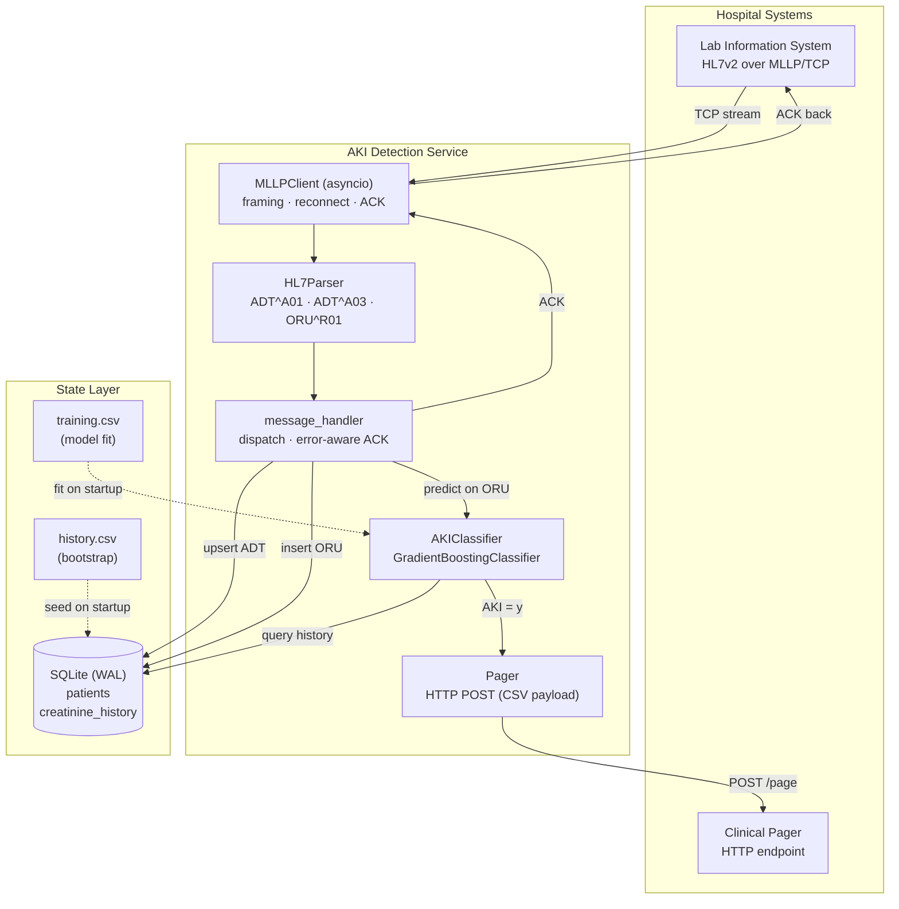

# Real-Time AKI Detection Service


> A fault-tolerant clinical event-stream processor that ingests HL7v2 lab
> messages over MLLP/TCP, maintains per-patient state in SQLite, runs an ML
> classifier on every new creatinine result, and pages the clinical response
> team when acute kidney injury is predicted.

---

## What This Project Does

A production-style ingestion and inference service for detecting **Acute
Kidney Injury (AKI)** from live hospital lab feeds. Messages arrive as HL7v2
ADT / ORU encounters wrapped in MLLP framing over a TCP socket; the service
parses them, updates state, scores each new creatinine reading against a
gradient-boosted classifier, and fires a pager HTTP call on positive
predictions.

**Core capabilities:**

- **Asyncio MLLP client** — long-lived TCP connection with partial-frame
  buffering, framing-byte validation, automatic reconnect on failure, and
  `AA` / `AE` / `AR` ACK responses per HL7 spec
- **HL7v2 parser** — typed dataclasses for `ADT^A01`, `ADT^A03`, `ORU^R01`
  messages; safe field access that tolerates missing segments
- **Stateful patient store** — SQLite in WAL mode for durability across
  restarts, bootstrapped from a historical CSV snapshot
- **ML inference engine** — `GradientBoostingClassifier` with rolling-window
  feature engineering derived from the NHS AKI detection algorithm
  (C1, RV1, RV2, D_48h, ratios)
- **Pager integration** — HTTP `POST` with CSV-framed `mrn,timestamp`
  payload, structured error logging on failure
- **Graceful lifecycle** — `SIGINT` / `SIGTERM` handlers, clean DB close,
  structured logging with daily rotation
- **Test suite** — 144 pytest unit + integration cases including
  asyncio-mocked MLLP protocol tests

---

## Architecture



---

## Key Engineering Highlights

| Area | Detail |
|---|---|
| **Asyncio MLLP framing** | Byte-level state machine parses `0x0B … 0x1C 0x0D` MLLP frames across TCP packet boundaries — partial messages are buffered rather than discarded, and framing violations raise explicit errors instead of silent truncation |
| **Auto-reconnect resilience** | The client survives simulator restarts and network drops via an outer reconnect loop with configurable delay (`reconnect_delay=5s`), distinguishing graceful shutdown from failure paths so SIGTERM does not trigger a reconnect |
| **Correct HL7 ACK semantics** | `_generate_ack` rebuilds the `MSH` segment from the inbound message (swapping sending/receiving application/facility) and emits `AA` on success, `AE` on handler exceptions, and a minimal `AE` fallback when MSH parsing itself fails |
| **NHS AKI feature engineering** | Computes `C1` (current), `RV1` (7-day minimum), `RV2` (8–365-day median), `D_48h` (delta vs. 48-hour low), and `C1/RV1`, `C1/RV2` ratios from rolling creatinine history — all derived at inference time from SQLite state |
| **Durable state via SQLite WAL** | Write-ahead logging with `PRAGMA synchronous=NORMAL` gives crash-safe writes with high throughput; indexed MRN lookup keeps per-event feature extraction sub-millisecond |
| **Boundary between sync and async** | The blocking `Pager.page` `requests` call is offloaded via `asyncio.to_thread` so a slow pager endpoint cannot stall the MLLP read loop |
| **Handler-to-ACK error propagation** | Exceptions inside the message handler propagate out so the MLLP client can downgrade the ACK to `AE`, rather than silently ACKing (`AA`) failed messages |
| **Config via environment** | `MLLP_ADDRESS`, `PAGER_ADDRESS`, `DB_PATH`, `HISTORY_CSV`, `TRAINING_CSV`, `LOG_LEVEL` — all resolved at startup with defaults plus fallback path probing for containerised vs. local runs |
| **Test coverage** | 144 tests across 6 files: MLLP buffer parsing (partial / multi / framing-error cases), ACK generation paths, HL7 field extraction, classifier feature-engineering windows, DB CRUD, and full CSV→DB→inference integration |
| **Dockerised deployment** | Two Docker images — `simulator` for replaying canned HL7 traffic and the service image itself, configured purely through env vars for portability |

---

## Tech Stack

| Layer | Technology |
|---|---|
| Runtime | Python 3.13, `asyncio` |
| Protocol | HL7v2 + MLLP framing over TCP |
| HL7 parsing | `hl7` |
| State store | SQLite (WAL mode) via stdlib `sqlite3` |
| ML | `scikit-learn` `GradientBoostingClassifier`, `pandas`, `numpy` |
| HTTP (pager) | `requests` |
| Logging | stdlib `logging` with `TimedRotatingFileHandler` (daily) |
| Testing | `pytest`, `unittest.mock` (Async + sync) |
| Packaging | Docker (Ubuntu `noble`) |

---

## Project Structure

```text
.
├── main.py                              # Entrypoint — env resolution, handler, lifecycle
├── Dockerfile                           # Service image
├── requirements.txt
├── pyproject.toml                       # pytest config (pythonpath)
├── conftest.py
├── src/
│   ├── logger.py                        # Rotating file + console logger
│   ├── mllp/
│   │   └── client.py                    # Asyncio MLLP client + ACK generation
│   ├── hl7/
│   │   └── parser.py                    # ADT / ORU parsing into dataclasses
│   ├── database/
│   │   └── patient.py                   # SQLite (WAL) patient + creatinine store
│   ├── model/
│   │   └── aki.py                       # GBM classifier + feature engineering
│   └── pager/
│       └── pager.py                     # HTTP pager client (CSV / JSON)
├── data/
│   ├── history.csv                      # Bootstrap patient history
│   └── training.csv                     # Classifier training set
├── simulator/                           # Coursework-provided HL7/MLLP replay server
│   ├── simulator.py
│   ├── Dockerfile
│   └── messages.mllp
└── tests/
    ├── test_mllp_client.py              # Framing, ACK, reconnect, shutdown
    ├── test_hl7_parser.py               # Segment extraction, datetime, age
    ├── test_patient_db.py               # Schema, upsert, query, close
    ├── test_aki_classifier.py           # Feature engineering, predict, train
    ├── test_pager.py                    # POST payload shape, error handling
    └── integration/
        └── test_patient_db_integration.py   # CSV → DB → query end-to-end
```

---

## Local Setup

```bash
# 1. Clone and enter the repo
git clone https://github.com/catalinatan/real-aki-alerting.git
cd real-aki-alerting

# 2. Create and activate a virtual environment
python3 -m venv .venv
source .venv/bin/activate

# 3. Install dependencies
pip install -r requirements.txt

# 4. (Optional) Override defaults via env vars
export MLLP_ADDRESS=localhost:8440
export PAGER_ADDRESS=localhost:8441
export LOG_LEVEL=INFO

# 5. Run the service
python main.py
```

### Configuration

| Variable        | Default             | Purpose                       |
| --------------- | ------------------- | ----------------------------- |
| `MLLP_ADDRESS`  | `localhost:8440`    | HL7 MLLP source `host:port`   |
| `PAGER_ADDRESS` | `localhost:8441`    | Pager HTTP endpoint           |
| `DB_PATH`       | `data/patient.db`   | SQLite file location          |
| `HISTORY_CSV`   | `data/history.csv`  | Bootstrap patient history     |
| `TRAINING_CSV`  | `data/training.csv` | Classifier training data      |
| `LOG_LEVEL`     | `INFO`              | `DEBUG` / `INFO` / `WARNING`  |
| `LOG_FILE`      | `app.log`           | Rotating log destination      |

---

## Running Tests

```bash
pytest
```

```text
144 passed in 2.40s
```

Coverage spans MLLP protocol framing (including partial-message and bad-byte
paths), ACK generation fallbacks, HL7 field extraction, classifier feature
engineering across overlapping date windows, full DB CRUD, and an
end-to-end CSV → DB → feature → prediction integration test.

---

## Running with Docker

### Service image

```bash
docker build -t aki-service .
docker run --rm \
  -e MLLP_ADDRESS=host.docker.internal:8440 \
  -e PAGER_ADDRESS=host.docker.internal:8441 \
  aki-service
```

### Simulator (for local end-to-end testing)

```bash
docker build -t aki-simulator ./simulator
docker run --rm -p 8440:8440 -p 8441:8441 aki-simulator
```

The simulator streams `simulator/messages.mllp` over MLLP on port `8440`
and exposes a pager HTTP endpoint on port `8441`.

---

## Data Attribution

`data/history.csv` and `data/training.csv` are synthetic coursework fixtures
— no real patient data is committed to the repository. The MLLP replay in
`simulator/messages.mllp` is provided by the course as a deterministic
replay fixture for integration testing.
