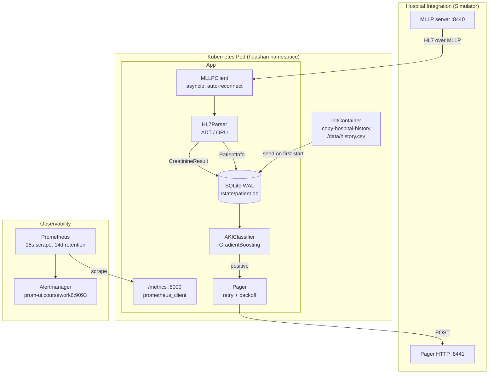

# AKI Detection Service


> Real-time Acute Kidney Injury (AKI) detection pipeline for hospital HL7 message streams — production-grade Python service deployed on Kubernetes with Prometheus-based observability and alerting.

---

## What This Service Does

The pipeline ingests an HL7v2 message stream from a hospital integration engine over MLLP, maintains patient state in a durable SQLite store, scores each incoming creatinine result with a trained `GradientBoostingClassifier`, and dispatches HTTP pages to the clinical response team when a positive AKI prediction is made.

**Core capabilities:**

- **MLLP ingest with auto-reconnect** — asyncio client that parses standard HL7 framing bytes, handles partial frames across TCP reads, and always ACKs to keep the upstream pipeline flowing (the simulator does not replay missed messages)
- **HL7v2 parsing** — typed dataclasses for `ADT^A01` / `ADT^A03` (demographics) and `ORU^R01` (creatinine observations), with graceful handling of malformed fields
- **Durable patient state** — SQLite in WAL mode with composite uniqueness on `(mrn, creatinine_date)` to prevent duplicate test records; state survives pod restarts via a `PersistentVolumeClaim`
- **ML inference on live results** — scikit-learn `GradientBoostingClassifier` trained at startup from `training.csv`; predictions run per creatinine result against the patient's full historical window
- **Pager dispatch with bounded retries** — HTTP POST to the pager with configurable retry count and backoff; failures increment a Prometheus counter that drives alerts
- **Prometheus observability** — HTTP server on port 8000 exposing counters, histograms, and a rule set that alerts on stalled ingest, pager failures, and MLLP connection churn

---

## Architecture



---

## Key Engineering Highlights

| Area | Detail |
|---|---|
| **Async MLLP client** | Custom buffered parser handles MLLP framing (`0x0B`, `0x1C`, `0x0D`), partial reads, decode errors, and read timeouts; always returns an `AA`/`AE` ACK so the simulator never stalls |
| **Stateful deployment** | A `PersistentVolumeClaim` mounts at `/state` so the patient database survives pod rescheduling; on startup `main.py` skips CSV re-seeding when the DB already exists |
| **Two-stage data init** | An `initContainer` copies the hospital history from an upstream image into an `emptyDir`, then the app container hydrates the SQLite DB on first launch only |
| **Quota-safe rollouts** | `maxSurge: 0`, `maxUnavailable: 1` keeps the replica count within the namespace quota during rolling updates |
| **Prometheus alert rules** | Embedded `ConfigMap` defines four rules: `MessagesNotBeingReceived`, `BloodTestsNotFlowing`, `PagerErrorsOccurring`, `MLLPReconnections` — each tuned with a `for:` window to suppress transient noise |
| **Bounded pager retries** | `Pager.page()` retries on any `RequestException` with configurable attempts and delay; every failure increments `pager_errors_total`, which backs the alert rule |
| **Typed HL7 parsing** | `PatientInfo` and `CreatinineResult` dataclasses isolate parser output from downstream consumers; unsupported message types are skipped rather than erroring |
| **Test coverage** | 163 unit and integration tests across parser, DB, classifier, MLLP client, pager, and metrics modules — all passing |

---

## Tech Stack

| Layer | Technology |
|---|---|
| Language / runtime | Python 3.12, `asyncio` |
| HL7 parsing | [`hl7`](https://pypi.org/project/hl7/) |
| ML | scikit-learn `GradientBoostingClassifier`, pandas, numpy |
| Storage | SQLite (WAL mode) |
| Observability | `prometheus_client`, Prometheus v2.54, Alertmanager |
| Transport | MLLP (TCP), HTTP (`requests`) |
| Container / orchestration | Docker, Kubernetes, Azure Container Registry, `managed-csi` PV |
| Tests | pytest |

---

## Repository Structure

```text
.
├── main.py                    # Async entrypoint: wires MLLP → parser → DB → model → pager
├── Dockerfile                 # Ubuntu noble + venv + requirements
├── deployment.yaml            # PVC + Service + Deployment + Prometheus ConfigMap + Prometheus Deployment
├── requirements.txt
├── pyproject.toml
├── src/
│   ├── hl7/parser.py          # HL7 ADT/ORU parser → PatientInfo / CreatinineResult dataclasses
│   ├── mllp/client.py         # Async MLLP client, framing parser, ACK generator, auto-reconnect
│   ├── database/patient.py    # SQLite schema + upsert / insert / query in WAL mode
│   ├── model/aki.py           # GradientBoostingClassifier wrapper with feature extraction
│   ├── pager/pager.py         # HTTP pager with bounded retries
│   ├── metrics.py             # Prometheus counters, histogram, metrics HTTP server
│   └── logger.py              # Structured logger
├── data/
│   ├── history.csv            # Seed patient history
│   └── training.csv           # Labelled training set
├── simulator/                 # Local MLLP + pager simulator for integration runs
└── tests/
    ├── test_hl7_parser.py
    ├── test_mllp_client.py
    ├── test_patient_db.py
    ├── test_aki_classifier.py
    ├── test_pager.py
    ├── test_metrics.py
    └── integration/test_patient_db_integration.py
```

---

## Local Development

```bash
# 1. Set up a virtual environment
python3 -m venv .venv
source .venv/bin/activate

# 2. Install runtime + test dependencies
pip install -r requirements.txt

# 3. Run the test suite
pytest
```

---

## Container Build & Registry Push

```bash
docker build -t imperialswemlsspring2026.azurecr.io/coursework6-huashan .
docker push   imperialswemlsspring2026.azurecr.io/coursework6-huashan
```

---

## Kubernetes Deployment

`deployment.yaml` is the single source of truth and provisions five resources in the `huashan` namespace: the state `PersistentVolumeClaim`, the `aki-detection` `Service` and `Deployment`, and the Prometheus `ConfigMap` + `Deployment`.

```bash
kubectl apply -f deployment.yaml
kubectl -n huashan rollout status deployment/aki-detection --timeout=120s
```

Expected output:

```
deployment "aki-detection" successfully rolled out
```

### Preconfigured environment

| Variable | Value |
|---|---|
| `MLLP_ADDRESS` | `huashan-simulator.coursework6:8440` |
| `PAGER_ADDRESS` | `huashan-simulator.coursework6:8441` |
| `DB_PATH` | `/state/patient.db` (PVC-backed) |
| `HISTORY_CSV` | `/data/history.csv` (from `initContainer`) |
| `TRAINING_CSV` | `/app/training.csv` (baked into the image) |

### Rollout strategy

`maxSurge: 0`, `maxUnavailable: 1` — guarantees a new pod is only scheduled after the old one terminates, which keeps the deployment within a tight namespace quota at the cost of a brief interruption during updates.

---

## Observability

Metrics are exposed on port `8000` and scraped every 15 seconds by the Prometheus instance in the same namespace.

### Port-forward and inspect

```bash
POD=$(kubectl -n huashan get pods -l app=aki-detection -o jsonpath='{.items[0].metadata.name}')
kubectl -n huashan port-forward "$POD" 8000:8000
curl -s localhost:8000/metrics
```

### Exported metrics

| Metric | Type | Meaning |
|---|---|---|
| `messages_received_total` | counter | HL7 messages successfully framed off the wire |
| `blood_tests_received_total` | counter | Creatinine results parsed from ORU messages |
| `aki_predictions_total{result}` | counter | Classifier verdicts, labelled `positive` / `negative` |
| `pages_sent_total` | counter | Successful pages to the clinical team |
| `pager_errors_total` | counter | HTTP failures dispatching pages |
| `mllp_reconnections_total` | counter | MLLP socket reconnect attempts |
| `blood_test_value` | histogram | Distribution of creatinine values observed |

### Alert rules

Defined inline in the Prometheus `ConfigMap` in `deployment.yaml`:

| Alert | Expression | For | Severity |
|---|---|---|---|
| `MessagesNotBeingReceived` | `rate(messages_received_total[5m]) == 0` | 10m | critical |
| `BloodTestsNotFlowing` | `rate(blood_tests_received_total[5m]) == 0` | 10m | critical |
| `PagerErrorsOccurring` | `rate(pager_errors_total[5m]) > 0` | 2m | warning |
| `MLLPReconnections` | `rate(mllp_reconnections_total[5m]) > 0` | 2m | warning |

---

## Operational Runbook

### Inspect pod state

```bash
kubectl -n huashan get pods -l app=aki-detection -o wide
kubectl -n huashan logs -f deployment/aki-detection -c aki-detection
kubectl -n huashan get events --sort-by=.lastTimestamp | tail -n 20
```

### Rollout stuck

```bash
kubectl -n huashan describe deployment aki-detection | \
  grep -E "ProgressDeadlineExceeded|ReplicaFailure|FailedCreate"
kubectl -n huashan get events --sort-by=.lastTimestamp | tail -n 40
```

If the cause is a transient scheduling or network hiccup, forcing a pod recreate is safe because state is PVC-backed:

```bash
kubectl -n huashan delete pod -l app=aki-detection
```

### Known benign log line

`MLLP read timed out — connection may be dead.` is expected when the simulator is idle; the client reconnects automatically and `mllp_reconnections_total` increments. Investigate only if the `MLLPReconnections` alert fires (rate sustained above zero for >2 minutes).
